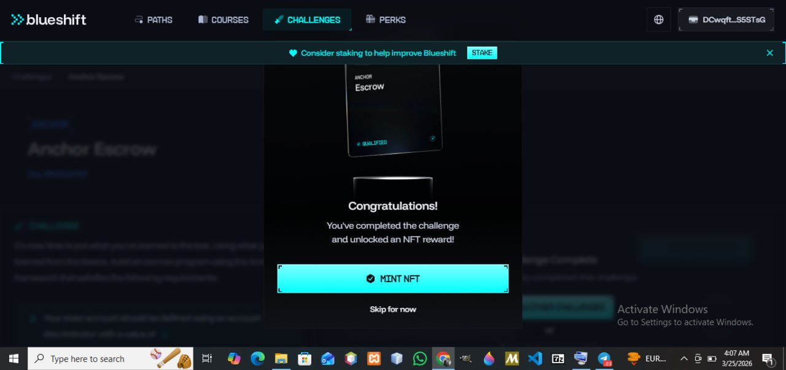

**Anchor Escrow Challenge – Blueshift**

**Overview**
This repository contains my solution for the Anchor Escrow challenge on Blueshift⁠�.
The challenge was to build a Solana escrow program using the Anchor framework that allows users to:
Make an escrow offer :– A maker can initiate an escrow swap.
Take an escrow offer :– A taker can accept an escrow swap.
Cancel an escrow offer – The maker can cancel and refund the escrowed funds.

**About This Project**
This project was a learning experience in building secure Solana programs. The key focus areas included:
Understanding Anchor instructions and account discriminators.
Working with program-derived accounts (PDAs).
Handling rent-exemption and account ownership.
Debugging deployment issues, including DeclaredProgramIdMismatch errors.

**How to Build**

Clone the repository:
Bash
Copy code
git clone https://github.com/<your_username>/<repo_name>.git
cd <repo_name>

**Install dependencies**:
Bash
Copy code
anchor install

**Build the program**:
Bash
anchor build
Note: The program ID has been aligned with the fixed example ID expected by the Blueshift challenge:
declare_id!("22222222222222222222222222222222222222222222");
Run tests:
Bash
Copy code
anchor test
Structure
Copy code

programs/
  blueshift_anchor_escrow/
    src/
      lib.rs        # Main program logic
      instructions/ # Make, Take, Refund instructions
      state.rs      # State account definitions
tests/
  anchor_escrow_tests.rs  # Tests for all instructions
Anchor.toml

**Submission & Verification**
Wallet for NFT: DCwqftGn7mtRZj6UT1VZikUfpUbLBiecZtwAE1S5STsG
Twitter thread sharing my experience: 

https://x.com/i/status/2036700225369194517

**Notes**
Some issues encountered were platform-specific, such as the program ID expected by Blueshift tests.
Debugging these helped deepen understanding of Anchor deployments and Solana account mechanics.
